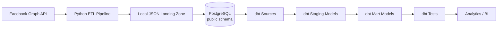

# Social Media ETL & Analytics Pipeline

A modern data engineering project that extracts Facebook social media data through a Python ETL pipeline, stores validated data in PostgreSQL, and uses dbt to build a structured analytics layer with automated data quality testing.

---

# 🚀 Project Overview

This project demonstrates an end-to-end **Extract–Transform–Load (ETL)** pipeline followed by a downstream **dbt (Data Build Tool)** transformation layer.

The Python ETL pipeline is responsible for:

- Extracting posts and comments from the Facebook Graph API.
- Persisting raw API responses in a local JSON landing zone.
- Validating and standardizing data using Pydantic models.
- Loading validated data into PostgreSQL using **idempotent bulk upserts** (`INSERT ... ON CONFLICT DO UPDATE`).

Once the ETL completes successfully, dbt automatically:

- Builds staging models.
- Builds analytics-ready mart models.
- Executes automated data quality tests.

The entire project runs with a **single Docker Compose command**.

---

# 🏗 Solution Architecture



---

# ⚙ Pipeline Execution

Run the complete project with:

```bash
docker compose up --build
```

Execution order:

```text
Build Docker Image
        │
        ▼
Start PostgreSQL
        │
        ▼
Wait for PostgreSQL Health Check
        │
        ▼
Run Python ETL
        │
        ▼
Extract Facebook Data
        │
        ▼
Save Raw JSON
        │
        ▼
Validate using Pydantic
        │
        ▼
Bulk Upsert into PostgreSQL
        │
        ▼
Run dbt Models
        │
        ▼
Run dbt Tests
        │
        ▼
Analytics Ready
```

---

# 🛠 Technology Stack

| Category            | Technology            |
| ------------------- | --------------------- |
| Language            | Python 3.11           |
| Data Validation     | Pydantic              |
| Data Processing     | Pandas                |
| Database            | PostgreSQL 16         |
| ORM                 | SQLModel / SQLAlchemy |
| Data Transformation | dbt                   |
| Containerization    | Docker                |
| Orchestration       | Docker Compose        |

---

# 📂 Project Structure

```text
.
├── data/
│   └── raw/
│       └── facebook/
│           └── {page_id}/
│               ├── posts/
│               └── comments/
│
├── dbt/
│   └── social_media_dbt/
│       ├── models/
│       │   ├── staging/
│       │   ├── marts/
│       │   └── sources.yml
│       ├── dbt_project.yml
│       └── profiles.yml
│
├── src/
│   ├── facebook/
│   ├── models/
│   ├── pipeline/
│   ├── storage/
│   └── warehouse/
│
├── docker-compose.yml
├── Dockerfile
└── README.md
```

---

# 🔄 Python ETL Workflow

The ETL pipeline follows the standard **Extract → Transform → Load** process.

## 1. Extract

The pipeline connects to the Facebook Graph API and retrieves:

- Facebook posts
- Facebook comments

---

## 2. Transform

Before loading data into PostgreSQL, the ETL performs several transformation steps.

### Landing Zone

Raw API responses are stored locally as JSON files:

```text
data/raw/facebook/{page_id}/{posts|comments}/{year}/{month}/{day}/
```

Benefits:

- Preserves the original API response.
- Supports auditability.
- Enables data reprocessing without calling the API again.

---

### Data Validation

Every record is validated using **Pydantic** models.

Validation includes:

- Required fields
- Data types
- Schema consistency

Only valid records continue through the pipeline.

---

### Data Preparation

Validated records are converted into Pandas DataFrames for efficient loading into PostgreSQL.

---

## 3. Load

The ETL loads data into:

- `public.posts`
- `public.comments`

using PostgreSQL **bulk upserts** (`INSERT ... ON CONFLICT DO UPDATE`).

This makes the pipeline **idempotent**, allowing repeated executions without creating duplicate records.

---

# 🔄 dbt Transformation Layer

dbt operates after the ETL has loaded data into PostgreSQL.

## Source Layer

The source layer registers:

- `public.posts`
- `public.comments`

as warehouse sources.

---

## Staging Layer

The staging models:

- `stg_posts`
- `stg_comments`

provide a stable interface between the raw warehouse tables and downstream analytical models.

---

## Mart Layer

The mart models:

- `fct_posts`
- `fct_comments`

represent the analytics-ready reporting layer.

Although currently implemented as pass-through views, this layer is designed to support future business logic, aggregations, and reporting metrics.

---

## Data Quality

dbt automatically validates warehouse data using:

- `unique`
- `not_null`

tests on:

- `post_id`
- `comment_id`

These tests execute after every pipeline run to ensure warehouse integrity.

---

# 📊 Database Layers

| Layer         | Objects                       | Purpose                         |
| ------------- | ----------------------------- | ------------------------------- |
| Landing Zone  | JSON Files                    | Preserve raw API responses      |
| Raw Warehouse | public.posts, public.comments | Validated ETL output            |
| Staging       | stg_posts, stg_comments       | Stable transformation layer     |
| Mart          | fct_posts, fct_comments       | Analytics-ready reporting layer |

---

# ✨ Project Highlights

- End-to-end Python ETL pipeline
- Facebook Graph API integration
- Local JSON landing zone
- Pydantic schema validation
- Pandas-based data processing
- PostgreSQL warehouse
- Idempotent bulk upserts
- dbt source, staging, and mart architecture
- Automated dbt data quality testing
- Docker Compose orchestration
- Single-command pipeline execution

---

# 📌 Skills Demonstrated

- Python
- SQL
- PostgreSQL
- Pandas
- Pydantic
- SQLAlchemy
- SQLModel
- Docker
- Docker Compose
- dbt
- ETL Design
- Data Validation
- Data Warehousing

---

# 🚀 Getting Started

## Prerequisites

- Docker Desktop
- Git

---

## Clone the Repository

```bash
git clone <repository-url>
cd social_media
```

---

## Configure Environment

Create a `.env` file and configure:

- Facebook API credentials
- PostgreSQL connection settings

---

## Run the Complete Pipeline

```bash
docker compose up --build
```

This command automatically:

1. Builds the Docker image.
2. Starts PostgreSQL.
3. Waits for PostgreSQL to become healthy.
4. Executes the Python ETL pipeline.
5. Loads validated data into PostgreSQL.
6. Runs dbt transformations.
7. Executes dbt data quality tests.

No additional commands are required.

---

# 🔧 Development Commands

Run only the ETL pipeline:

```bash
docker compose run --rm ingestion python src/main.py
```

Run dbt models:

```bash
docker compose run --rm dbt dbt run
```

Run dbt tests:

```bash
docker compose run --rm dbt dbt test
```

---

# ⚠ Current Limitations

- Mart models currently implement minimal business logic.
- dbt models are materialized as views.
- The ETL pipeline processes data sequentially.
- Pipeline execution is manual (`docker compose up --build`) rather than scheduled.

---

# 🛠 Future Improvements

- Implement incremental ETL loading.
- Add richer analytical mart models and business metrics.
- Introduce Apache Airflow for production orchestration.
- Add GitHub Actions for CI/CD.
- Generate interactive dbt documentation.
- Build Power BI dashboards on top of the mart layer.

---

# 📄 License

This project is intended for educational and portfolio purposes.
