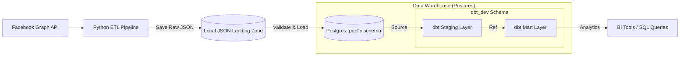

# Social Media ETL & Analytics Pipeline

A specialized data engineering pipeline that extracts Facebook social media data, processes it through a robust Python ETL engine, and utilizes dbt to implement a professional transformation layer for analytics.

## 🚀 Project Overview

This project implements a complete **Extract-Transform-Load (ETL)** pipeline with a downstream **dbt (Data Build Tool)** transformation layer. 

The project is designed to ensure data integrity at every stage: the Python ETL engine handles raw data extraction, local landing zone persistence, and strict Pydantic schema validation before loading data into the warehouse. Once the data is loaded, dbt takes over to implement a modular transformation architecture (staging and mart layers) to prepare the data for final analysis.

## 🏗 Architecture



## 🛠 Technology Stack

- **Language**: Python 3.11
- **Data Validation**: Pydantic (Schema enforcement and type safety)
- **Database**: PostgreSQL 16
- **Transformation**: dbt (Data Build Tool)
- **Orchestration**: Docker & Docker Compose
- **Environment**: Windows 11 / PowerShell

## 📂 Project Structure

```text
.
├── dbt/
│   └── social_media_dbt/       # dbt project root
│       ├── models/
│       │   ├── staging/         # Thin pass-through models (cleaning)
│       │   │   ├── stg_posts.sql
│       │   │   ├── stg_comments.sql
│       │   │   └── schema.yml    # Data quality tests
│       │   ├── marts/           # Business-ready models (fact tables)
│       │   │   ├── fct_posts.sql
│       │   │   ├── fct_comments.sql
│       │   │   └── schema.yml    # Data quality tests
│       │   └── sources.yml      # Raw table definitions
│       └── dbt_project.yml      # Project configuration
├── src/
│   ├── facebook/               # API client and ingestion logic
│   ├── models/                 # Pydantic models for data validation
│   ├── pipeline/               # ETL core (ingestion, transform, load)
│   └── warehouse/              # PostgreSQL connection and storage logic
├── docker-compose.yml           # Infrastructure orchestration
└── README.md
```

## 🔄 Workflows

### 1. Python ETL Workflow
The pipeline implements a strict **Extract $\rightarrow$ Transform $\rightarrow$ Load** sequence:

- **Extract**: Fetches raw data from the Facebook Graph API.
- **Transform**: 
    - **Landing**: Saves raw responses as JSON files in a hierarchical structure partitioned by `page_id`, `type`, and `date` for auditability.
    - **Processing**: Reads raw JSON, cleans and standardizes the data, and enforces strict type safety using **Pydantic models**.
    - **Preparation**: Converts validated data into optimized Pandas DataFrames.
- **Load**: Performs an idempotent "upsert" (Insert or Update) into the `public.posts` and `public.comments` tables in PostgreSQL.

### 2. dbt Transformation Layer
dbt complements the Python ETL by handling the warehouse-level transformations *after* the data has been loaded:

1. **Source**: `sources.yml` identifies the `public` tables (loaded by Python) as the raw inputs.
2. **Staging Layer**: `stg_` models create thin views in the `dbt_dev` schema to decouple raw data from business logic.
3. **Mart Layer**: `fct_` models create the final analytics-ready views.
4. **Data Quality**: `unique` and `not_null` tests are applied to primary keys (`post_id`, `comment_id`) to ensure the warehouse remains a reliable source of truth.

## 📊 Database Schema

| Layer | Table/View | Description | Key Constraint |
| :--- | :--- | :--- | :--- |
| **Raw** | `public.posts` | Raw Facebook posts loaded via Python ETL | `post_id` |
| **Raw** | `public.comments` | Raw Facebook comments loaded via Python ETL | `comment_id` |
| **Staging** | `dbt_dev.stg_posts` | Cleaned view of posts | `unique`, `not_null` |
| **Staging** | `dbt_dev.stg_comments` | Cleaned view of comments | `unique`, `not_null` |
| **Mart** | `dbt_dev.fct_posts` | Final analytics-ready posts view | `unique`, `not_null` |
| **Mart** | `dbt_dev.fct_comments` | Final analytics-ready comments view | `unique`, `not_null` |

## ✨ Features

- **End-to-End Pipeline**: Complete flow from API extraction to analytics-ready views.
- **Data Integrity**: Pydantic validation prevents malformed API data from entering the database.
- **Auditability**: Local JSON landing zone keeps a permanent record of raw API responses.
- **Modular Design**: Separates ingestion (Python) from warehouse transformation (dbt).
- **Testing Framework**: Integrated dbt tests to programmatically verify data quality.
- **Containerized Stack**: Full environment reproducibility using Docker Compose.

## ⚠️ Limitations

- **Full Refreshes**: The current dbt models are views; complex logic would require switching to table materialization for performance.
- **Simple Marts**: Mart models are currently pass-throughs; advanced business aggregations are not yet implemented.
- **Single-threaded Ingestion**: The Python ETL processes data sequentially.

## ⚙️ Getting Started

### Prerequisites
- Docker Desktop installed and running.

### Installation & Setup
1. Clone the repository.
2. Start the infrastructure:
   ```bash
   docker compose up -d
   ```

### Running the Pipeline

#### 1. Run the ETL Pipeline
Extracts, transforms, and loads data into the raw PostgreSQL tables:
```bash
docker compose run --rm ingestion python src/main.py
```

#### 2. Run dbt Transformations
Transforms raw data into staging and mart views:
```bash
docker compose run --rm dbt dbt run
```

#### 3. Run Data Quality Tests
Verifies that primary keys are unique and not null:
```bash
docker compose run --rm dbt dbt test
```

## 🛠 Future Improvements
- **Incremental Loading**: Implement delta loading in the Python ETL to avoid full table refreshes.
- **Advanced Analytics**: Build joined mart models (e.g., `fct_engagement`) to analyze post-comment relationships.
- **Airflow Orchestration**: Move from manual Docker runs to a scheduled DAG for the entire pipeline.
- **CI/CD Pipeline**: Add GitHub Actions to automate `dbt test` on every commit.
